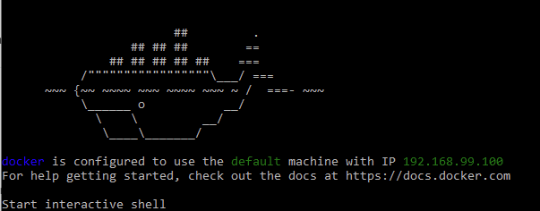
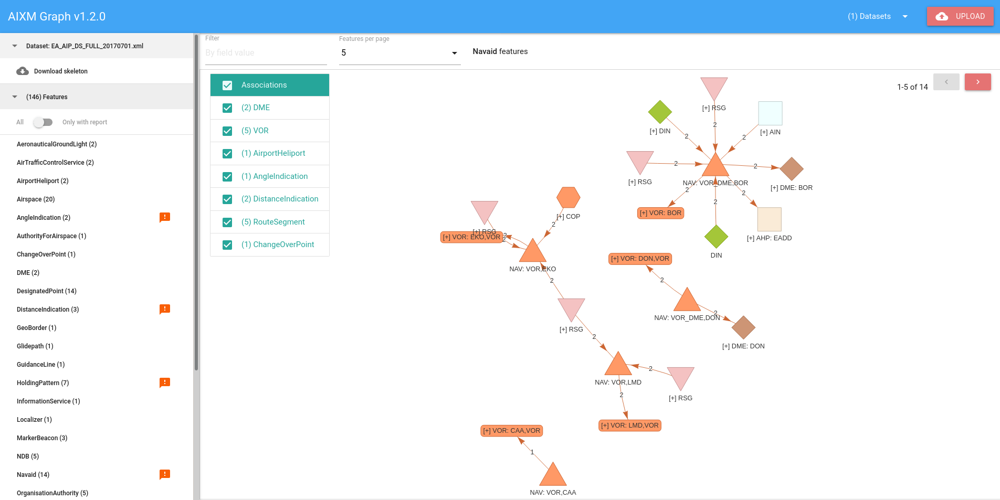

# AIXM Graph v1.1
> Visualizing AIXM feature associations

AIXM Graph is a tool that aims at visualizing the various features that can be found in an [AIXM](http://aixm.aero/) 
dataset along with their associations. The representation is made via an interactive graph where the user can explore 
the features and how they connect to each other in the specific dataset. 

At this [link](https://aixm-graph.herokuapp.com/#!) you can have a look at a partial (no upload functionality) demo of 
the tool and play around with two preloaded AIXM datasets.

## Installation

The project can get easily up and running in any machine regardless the running OS with the help of 
[Docker](https://www.docker.com/).

> Before proceeding to the next steps please make sure that you have installed on your machine:
> - Linux/Mac users
>     - [Git](https://git-scm.com/book/en/v2/Getting-Started-Installing-Git) 
>     - [Docker](https://docs.docker.com/get-docker/)
>         - Linux users will also need to have a look on some 
>           [post-installation actions](https://docs.docker.com/engine/install/linux-postinstall/):  
> - Windows users
>     - [Docker Toolbox on Windows](https://docs.docker.com/toolbox/toolbox_install_windows/) (which installs all the
>       required tools and runs the Docker Engine via VirtualBox)
>     - Since Docker runs via VirtualBox, the various app/server sites involved in this demo will 
>       not be able to be accessed from your host machine unless you apply some port forwarding 
>       rules. You may find instructions about how to do it 
>       [here](https://www.simplified.guide/virtualbox/port-forwarding). 
>       The  rule to apply is:
>        
>        | Name | Host port | Guest Port |
>        |---|---|---|
>        | aixm-graph | 3000 | 3000 |


Steps:

Get the repository

```shell script
git clone git@github.com:eurocontrol-swim/aixm-graph.git
cd aixm-graph
```

Build the image

```shell script
docker build -t aixm-graph:latest .
```

Run the container

```shell script
docker run -d --name aixm_graph -e "PORT=8765" -p 3000:8765 aixm-graph:latest
```

Make sure that the container is up and running with `docker ps`. The output should look like: 
```shell script 
CONTAINER ID        IMAGE               COMMAND                  CREATED             STATUS              PORTS                            NAMES
b1c6b3cb3e2b        aixm-graph:latest   "/bin/sh -c 'gunicor…"   2 seconds ago       Up 1 second         80/tcp, 0.0.0.0:3000->8765/tcp   aixm_graph
```


After the steps are successfully completed the project will be available at 
[http://localhost:3000](http://localhost:3000) 

> NOTE for Windows users:
>
> In case the above link does not work, you can use the IP used by Virtual Box. This can be found 
> while starting the docker interactive shell: 
>
> 
>
> In the above case the tool can be accessed by http://192.168.99.100:3000. Needless to mention
> that you'll need to replace the IP with yours.


### Update project
In case a new version of the tool is available you can update via the following steps:

Update the git repository (from the roop directory of the project)
```shell script
git pull --rebase origin master
```

Stop/remove the relevant container in case AIXM Graph already runs
```shell script
docker rm -f aixm_graph
```

Then you can follow the installation steps from `Build the image` onward.


## For developers

The project is divided in two parts: server and client. 

The server is the backend where the uploading and processing of the datasets happens. The api is implemented with the 
miniframework [Flask](https://flask.palletsprojects.com/en/1.1.x/) and the dataset processing is made with the library
[lxml](https://lxml.de/). 

The client is the frontend where the datasets are visualized. The interface is implemented with the framework 
[Vue.js](https://vuejs.org/) while the graphs are created using the library 
[vis-network](https://github.com/visjs/vis-network).

In order to run the project locally on your machine for development reasons you need to start the server 
and the client separately.

### Server
> First make sure that [python](https://www.python.org/downloads/) and 
>[conda](https://docs.conda.io/projects/conda/en/latest/user-guide/install/) are installed on your system.


Create a dedicated environment using conda

```shell script
cd server
conda env -create --name aixm-graph -f requirements.yml
```

activate the environment

```shell script
source activate aixm-graph
```

install the server package in your env

```shell script
pip install . 
```

run the local server

```shell script
python ./aixm_graph/app.py
```

The server should now be able to receive calls at http://localhost:5000

### Client
> Make sure you have [npm](https://www.npmjs.com/get-npm) installed on your system


First install the dependencies

```shell script
cd client
npm install
```

and then run the client locally

```shell script
npm run serve
```

The client should now be available at [http://localhost:8080](http://localhost:8080)


### Deploying / Publishing
Since the project is packaged with docker there are many options of easily deploying it in the cloud. On of them is 
[Heroku](https://heroku.com) and below you can find the steps about how to achieve this with the 
[Container Registry & Runtime](https://devcenter.heroku.com/articles/container-registry-and-runtime) method:

> Make sure you have the [Heroku CLI](https://devcenter.heroku.com/articles/heroku-cli) installed on you system

First create a heroku app

```shell script
cd aixm-graph
heroku create <app-name>
```

Login to the Heroku Container Registry:

```shell script
heroku container:login
```

> Make sure to replace <app-name> in the below commands with the name of the Heroku app that you just created.

Build the image and tag it with the following format:

```shell script
docker build -t registry.heroku.com/<app-name>/web
```

Push the image to the registry:

```shell script
docker push registry.heroku.com/<app-name>/web
```

Release the image:

```shell script
heroku container:release --app <app-name> web
```
The app should now be available at [https://<app-name>.herokuapp.com](https://<app-name>.herokuapp.com)

## <a name="configuration"></a> Configuration
The tool does not require any specific configuration by the user as everything has been pre-configured. However, its 
worth looking at the configuration of the AIXM features in case something needs to be changed indeed. It can be found 
under `aixm-graph/server/aixm_graph/config.yml`.

The config entry for each feature looks like:

```yaml
AerialRefuelling:                  # the name of the feature as it is found in the dataset
  abbrev: ARF                      # a pre-selected abbreviation
  color: '#f0f8ff'                 # the color of the graph node that will represent this type of features
  shape: square                    # the shape of the graph node that will represent this type of features
  fields:                          # the elements that will be extracted from the timeSlice elements of that feature
    concat: true                   # determines whether the field values will be displayed concatenated or not
    names:                         # the list of all the element names
      - designatorPrefix
      - designatorNumber
      - designatorSuffix
      - designatorDirection
```

> NOTE: if a field name is wrongly configured the parsing of the dataset will fail.

> NOTE: The abbreviation has to be unique otherwise it will lead to confusion.

> NOTE: the available shapes are limited to: `dot, triangle, triangleDown, box, square, diamond, hexagon. ellipse`  .


## Features and usage
In the following sub-sections you can find a detailed description of the layout and the available features of the AIXM 
Graph tool as well as instructions about how to interact with it. If you just want a quick reference of them you can 
jump directly at the [end](#quick-reference) of this section.




### Navigation bar
The top bar of the tool offers two different actions. One for uploading/processing an AIXM dataset and one for 
navigating among already uploaded datasets.

#### Upload and process AIXM dataset
A new dataset can be uploaded to the server by clicking the `Upload` button at the top-right corner. 
As soon as the dataset is uploaded a pre-processing will take place including:
##### XML Parsing 
Each `xml` element/feature is parsed and stored along with it's [pre-configured](#configuration) key elements in memory.

##### Creation of bi-directional associations
Typically, a feature holds references (`xlink:href`) to other features it's associated with. However, this association 
has one direction in a typical AIXM dataset. In order to facilitate the creation of the graph and illustrate better the 
associations among the features we generate bi-directional connections on all of them. In other words, a feature will 
keep in memory references for all the other features which keep a reference to it. The procedure goes as following:
```shell script
for each xlink of a feature
    for each other target_feature check:
        if (
            the xlink:href matches the gml:id of the target_feature
            or the xlink:href matches the identifier of the target_feature
            or the xlink:href matches the gml:id of any of the properties of the target_feature
        )
        then:
            an extension (reverse association) is created in the target_feature
        otherwise:
            the xlink is marked as broken     
            
             
```

> Keep in mind that the uploading and the processing of the dataset depends heavily on its size. Although the procedure
> has been optimized and the whole processing/storing happens in memory, the final memory footprint equals more or less 
> the original size of the dataset. Thus, it has to be taken into consideration when attempting to upload/process a 
> dataset on a machine with limited resources. 

#### Navigate among existing datasets
As soon as a dataset is uploaded and processed it will be added in the dropdown list at the top-right corner. From there
you can opt for it any time and its data will be displayed in the [dataset area](#dataset-area).

###  <a name="dataset-area"></a> Dataset Area
The left side of the tool is the dataset area. This is where details and actions of the currently loaded dataset will be
displayed.

#### Download dataset skeleton
As soon as the name of the dataset is clicked, another button will be revealed just under it allowing the user to 
download the skeleton file of the currently uploaded dataset. It will have the same structure as the original one but it 
will be a subset of it as it will contain only the [pre-configured](#configuration) key elements and the xlink 
references. Additionally, all the references that were created during the processing phase will be added as extension 
elements. Lastly its name will be same as the original dataset's postfixed with `_skeleton`, i.e. 
`<original_filename>_skeleton.xml`.

#### Features
Next comes the features' area. The total number is reported in the title of the area, i.e. `(146) Features` and all the 
extracted features are listed below grouped by name, each one reporting the total number of its features. In case one or
more features of a group has broken links then a report icon  will be displayed alongside.
Upon mouse hover more details will be revealed about the broken xlinks.

Right below the title there is a switch filter allowing the user to display all the feature groups or only those ones
with a report. 
 
Every feature group is clickable and as soon as any of them is clicked the respective graph will be displayed on the
[graph area](#graph-area).


### <a name="graph-area"></a> Graph Area
The main area of the tool belongs to the graph area, where the features and their associations are visualized. It is 
split in two parts: the [top bar](#graph-area-top-bar) which contains manipulation actions as well as reporting of the 
currently displayed graph and the [graph](#graph-area-graph) where the actual graph lives.
  
#### <a name="graph-area-top-bar"></a> Top bar
As soon as a feature group is selected (clicked) from the [dataset area](#dataset-area) a graph of 
its features and their associations will be displayed. What is displayed though can be manipulated in three ways:

##### Filter by field
The user can limit the displayed features by filtering them on the values of their key fields. The filter is initiated as
soon as `Enter` is pressed.
> NOTE: the filter applies only on the features of the selected feature group and not on their associations

##### <a name="features-per-page"></a> Features per page
In case a feature group contains too many features they will be limited by the selected `Features per page` from the top
bar. The current available options are `5, 10, 15, 20`.
 
 
#### <a name="graph-area-graph"></a> Graph
The graph is represented by nodes and edges. The nodes represent the features of the selected feature group as well as 
their associations and the edges indicate their connection in the dataset.

> NOTE: when the graph is loaded or expanded, its performance depends heavily on the number of nodes currently being 
> displayed. In large datasets it is common that a feature can be associated with a big number of other features which 
> means that the created graph will be too big rendering the screen unresponsive. 
> 
> This is a current limitation of the tool but it can be partially handled either by limiting the displayed 
> [features per page](#features-per-page) or by [pruning](#pruning-associations) the first level associations of the 
> feature. If none of those options work you can always refresh the page in your browser and explore another feature group. 
 
##### Nodes
Each feature group is assigned with a [pre-configured](#configuration) color and shape. Thus each feature as well as 
its associations are represented as a graph node of a specific shape and color. In case an association is broken 
(i.e. does not correspond to any feature in the dataset) it will be represented as a red star 
. 

Additionally, each node will be labeled by a [pre-configured](#configuration) 
abbreviation along with the values of of its key fields separated by `,`, unless its configured to keep them concatenated.

For example an `Airspace` feature could be labeled as`ASE: CTA_P,EADD1` where `CTA_P` is its `type` and `EADD1` its `designator`. 

A `Route` feature though, which needs its field values concatenated, will be labeled as `RTE: UA4ATS` where `U` is the
`designatorPrefix`, `A` the `designatorSecondLetter`, `4` the `designatorNumber` and `ATS` its `type`.

###### Node details
As long as the mouse hovers over a node, then a popup box will appear displaying a table with more information about the
node including its feature name, its `UUID`, its key field along with their values as well as how many associations it
is connected with.

> TIP: as long as the popup box is displayed the user can copy its UUID into the clipboard by pressing `Ctrl + C`

###### Clicking on a node
    
- **Left click**: If an association feature node is connected with features other than the currently displayed ones then 
    its label will be prefixed with`[+]`, for example `[+] NAV: VOR,LMD`. That means that the association is expandable 
    and it can be expanded just by clicking (left click) on it. Then all its associations will be fetched from the 
    server and will be appended in the graph.
  
- **Right click**: A feature can be displayed in a single feature mode by right clicking on an it. A new graph will then 
    be created showing only the selected feature and its associations. 
    

##### Edges
The edges that connect the association features with the selected feature are named by the `timeSlice` those 
associations were found in and more specifically by its `sequenceNumber` and/or its `correctionNumber`. If an edge 
connects a feature with a broken association it will be dashed.

##### Next/Prev page
Lastly, in case the are more pages to display (i.e. more features) the user can navigate through them by clicking on the 
`Next` or `Prev` buttons.


#### <a name="pruning-associations"></a> Pruning association features
For every feature group that is selected, along with its graph there is also displayed a table with all the different
associations grouped by name. This table is placed at the top left corner of the graph and every
association group has a checkbox in front of it checked by default. As soon as a checkbox is deselected, the 
corresponding associations will be removed from the graph. In case an association has been expanded their descendants 
will be removed as well. If the checkbox is selected again, the corresponding associations will re-appear in the graph,
however, without their descendants. These actions can also apply in bulk mode by selecting/deselecting the 
checkbox at the header of the table.

### <a name="quick-reference"></a> Quick reference
- **Upload dataset**: at top-right corner button.
- **Navigate through datasets**: at top-right corner dropdown list.
- **Download skeleton**: at dataset area (left side) under the name of the dataset.
- **Filter feature groups by report**: at dataset area (left side) under the Features title.
- **Load graph for a specific feature group**: click on a feature group at the dataset area.
- **Manipulate the graph**
    - **via the top bar of graph area:**
        - filter the features on their key field values (type filter key and press `Enter`)
        - select the features per page to display.
    - **via the graph:**
        - navigate to next/previous pages, if any.
        - click on a feature node whose label starts with `[+]` to expand it with its associations.
        - right-click on a feature node to display it in single feature mode.
    - **via the associations table:**
        - deselect the checkbox of an association to remove all the corresponding nodes from the graph along with its 
          descendants if any.
        - select the checkbox of an association to add the corresponding nodes back in the graph.
    
    
## Contributing

If you'd like to contribute, please fork the repository and use a feature
branch. Pull requests are warmly welcome.


## Links

- Repository: https://github.com/eurocontrol-swim/aixm-graph
- Issue tracker: https://github.com/eurocontrol-swim/aixm-graph/issues
- AIXM: http://aixm.aero/

## Licensing

See LICENSE
